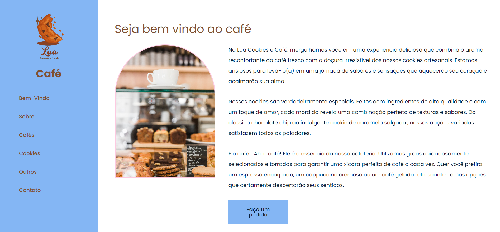
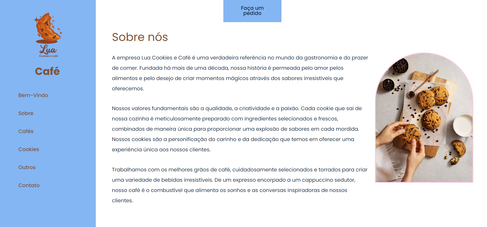
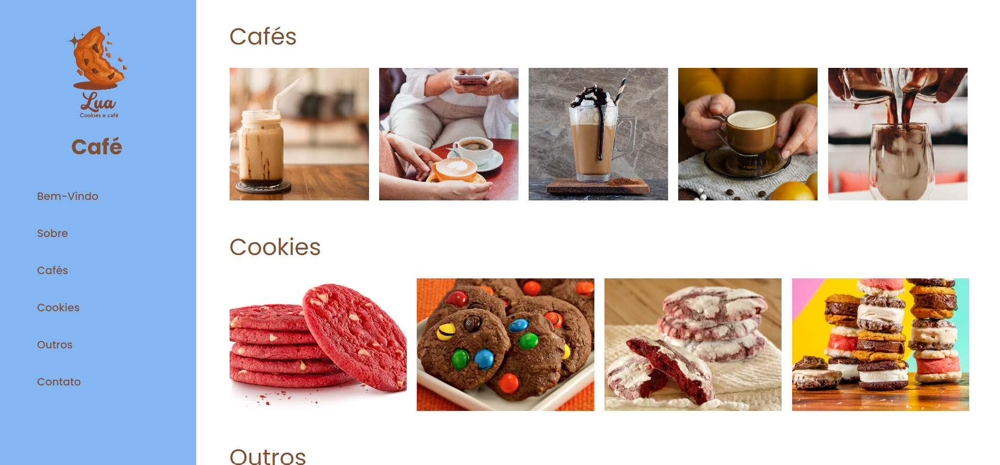
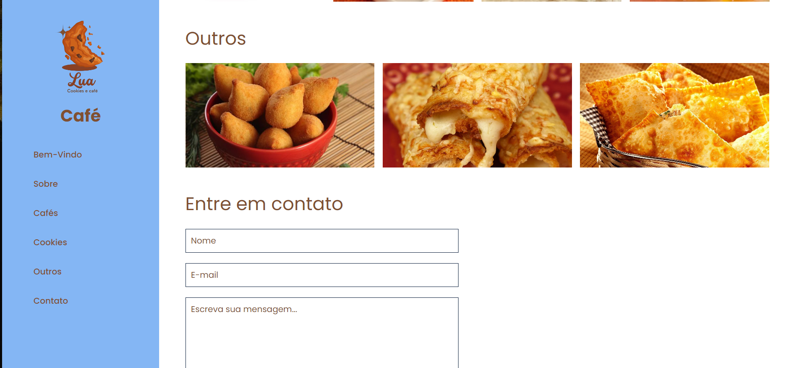
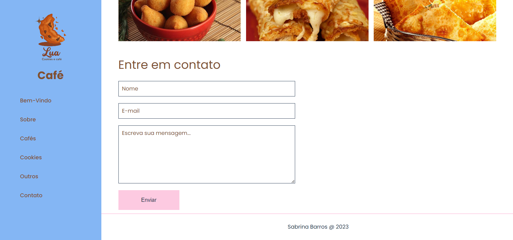

# Lua-Cafe-Pagina-Simples
Esta é uma pagina bem simples em HTML e CSS, que fiz para aprimorar meus conhecimentos.

<h2>Bem vindo</h2>

<h2>Sobre</h2>

<h2>Galerias</h2>

<h2>Contato e footer</h2>

